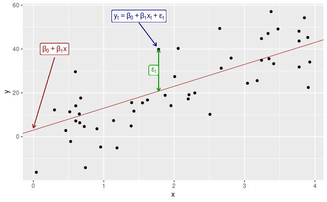
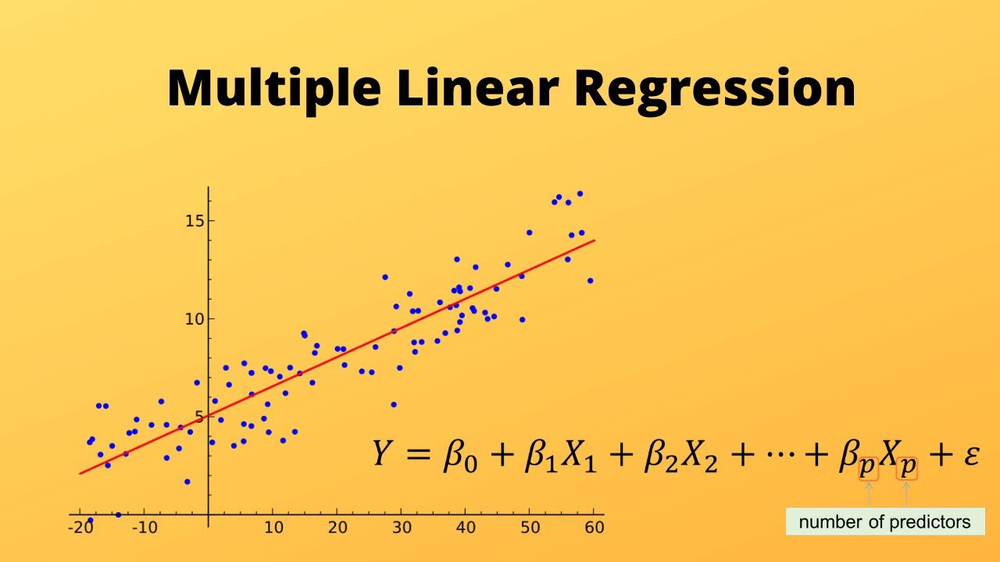

# Linear Regression With Credit Rating Prediction Project

Linear regression analysis is used to predict the value of a variable based on the value of another variable.

It performs the task to predict a dependent variable value (y) based on a given independent variable (x). So, this regression technique finds out a linear relationship between x (input) and y(output). 

The simplest form of a simple linear regression equation with one dependent and one independent variable is represented by:



**Similarly for multiple variable** 



<p></p>


## Project

Let’s consider a problem statement, we want to predict Credit Rating of a customer based on certain information of the customer.

Dataset Information:
The dataset contains information about 400 credit card holders, their credit balances, demographic features, etc.


Contents:
There are 11 variables.

1. Income: Income of the customer.
2. Limit: Credit limit provided to the customer.
3. Rating: The customer's credit rating.
4. Cards: The number of credit cards the customer has.
5. Age: Age of the customer.
6. Education: Educational level of the customer.¶
7. Gender: Sex of the customer.
8. Student: If the customer is a student or not.
9. Married: If the customer is married.
10. Ethnicity: Ethnicity of the customer.
11. Balance: Credit balance of the customer.

To solve this problem we use the above data and try to predict the Credit Rating of the customer.

Code Link: 
Linear_regression: LinearRegression.ipynb

## Installing statsmodels

To obtain the latest released version of statsmodels using pip:
```
python -m pip install statsmodels
```

## Dependencies
The current minimum dependencies are:
```
Python >= 3.8

NumPy >= 1.18

SciPy >= 1.4

Pandas >= 1.0

Patsy >= 0.5.2
```
