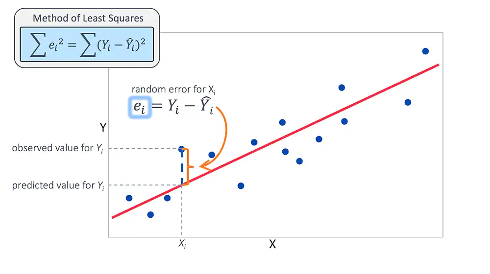

## What is Linear Regression?

<center></center>

The term "regression"  generally refers to predicting a real number. However, it can also be used for classification (predicting a category or class). Linear regression is a simple machine learning model which tries to establish a relationship between a target variable y and a set of input features x, assuming that the underlying relationship between the two is linear in nature.

A linear combination is an expression where one or more variables are scaled by a constant factor and added together. 
In the case of linear regression with a single explanatory variable, the linear combination used in linear regression can be expressed as:
    $$\mathbf{y_{i} = \beta_0 + \beta_1 x_i + \epsilon}$$   
    $\mathbf{\beta_0,\beta_1}$ are the parameters. Our goal is to estimate the parameters
    $\mathbf{\beta_0,\beta_1}$ using the training data where $\mathbf{(x_i, y_i)}$ are training examples

In case of more than one independent variable (Multiple linear regression), we will use $\mathbf{x_{ij}}$ to denote the indepedent variable and $\mathbf{y_{i}}$ to denote the dependent variable.The linear regression equation can be represented as

$$\mathbf{y_{i} = \beta_0 + \beta_1 x_{i1} + \beta_2 x_{i2} + .... \beta_n  x_{in} + \epsilon}$$  
$\mathbf{\beta_0,\beta_1,...,\beta_n}$ are the parameters.
<br><br>
## Why should we use Linear Regression?

<center></center>

1. Linear Regression is very versitile and is widly applicational
    - Regression analysis allows you to understand the strength of relationships between variables.
    - Regression analysis tells you what predictors in a model are statistically significant and which are not. 
    - Regression analysis can give a confidence interval for each regression coefficient that it estimates.
2. Linear Regression is easily understandable and explain
    Important factors that I always consider when choosing a model are how *simple* it and how *interpretable* it is. Why?
    - A simpler model means it’s easier to communicate how the model itself works and how to interpret the results of a model.
3. Linear Regression is very simple to implement but still very powerful
<br><br>
## Applications of Linear Regression:

<center></center>

1. Studying automobile engine performance
2. Weather data analysis
3. Analysis of Customer Survey results and market research studies
4. Observational astronomy
5. Least Squares estimates (the core principle behind Linear Regression) has applications in other domains
    - GPS positioning uses Weighted Linear Squares estimation to compute the user location. When applications like Google Maps/Uber require location, this procedure is invoked in the background.
6. Predict future sales of products with the help of its historical data.

### Let's deep dive in the *Sales Prediction* project

#### What is *Sales Prediction*?

- Sales prediction is the process of predicting the amount of product or services a sales unit (which can be an individual salesperson, a sales team, or a company) will sell in the next week, month, quarter, or year. 
- Predicting future sales for a company is one of the most important aspects of strategic planning.

#### Key terms
- Impressions
    - A Product Impression is defined as viewing one (or usually multiple) product offers on a given page (usually called as Product Listing Page or PLP).
- Clicks
    - A Product click is defined as clicking on a product and going to the Product Detail Page or PDP.
- Add to carts
    - An Add to cart is defined as adding a product to cart/shopping bag from a PDP.
- Sales
    - Total units sold of a particular product.
    
#### Features used for Linear Regression model:
1. Product Id
2. Trailing 1, 3, 7, 14 days impressions
3. Trailing 1, 3, 7, 14 days clicks
4. Trailing 1, 3, 7, 14 days add to carts
5. Gender
6. Category
7. Color
8. Price

#### Target Variable
- Leading 7 day sales

*Example data*

| Product ID | Trailing 1 day imprs | Trailing 3 days imprs | Trailing 7 days imprs | Trailing 14 days imprs | Trailing n days clicks | .... | Trailing n days a2cs | .... | Leading n days sales |
|------------|----------------------|-----------------------|-----------------------|------------------------|------------------------|------|----------------------|------|----------------------|
| 74441      | 12500                | 37500                 | 87500                 | 175000                 | 250                    | .... | 5                    | .... | 1                    |
| 74442      | 8900                 | 26700                 | 62300                 | 124600                 | 178                    | .... | 4                    | .... | 1                    |
| 74443      | 10200                | 30600                 | 71400                 | 142800                 | 204                    | .... | 4                    | .... | 1                    |
| 74444      | 9250                 | 27750                 | 64750                 | 129500                 | 185                    | .... | 4                    | .... | 1                    |
| 74445      | 15000                | 45000                 | 105000                | 210000                 | 300                    | .... | 6                    | .... | 2                    |


| Product ID | Gender | Category | Color | Price |
|------------|--------|----------|-------|-------|
| 74441      | Men    | T-Shirt  | Black | 299   |
| 74442      | Women  | Top      | Red   | 349   |
| 74443      | Women  | Shorts   | Black | 449   |
| 74444      | Men    | T-Shirt  | Blue  | 349   |
| 74445      | Men    | Shirt    | White | 649   |

#### Applications of *Sales Prediction*
1. We used these predictions for two particular applications. They are:
    - Inventory Management
        - Sales prediction helped us in estimating product sales. We used these estimates to decide the quantities of the products to be manufactured.
        
    - Product Ranking algorithm
        - Product ranking allows you to have granular control over the products that appear and their sequence in search results and on listing pages.
        - Earlier this process was done manually which took around 2 hours.
        - Using sales predictions to rank the products not only outperformed the existing approach in terms of revenue generated, but also removed manual efforts completely.

<br><br>
## Big Picture Of Linear Regression
- Linear Regression is a very common/popular regression method
- Linear Regression is versatile and widely applicational
- Linear Regression is less of a black box and is easily communicated and implemented

<center></center>

Please refer our example notebook. 
Code Link: <a href='https://github.com/ashrimal2/msds610/blob/main/code_demo/LinearRegression.ipynb'>LinearRegression.ipynb</a> (library used for Linear Regression is *statsmodels*)

<br><br>
## Installing statsmodels

To obtain the latest released version of statsmodels using pip:
```
python -m pip install statsmodels
```

## Dependencies
The current minimum dependencies are:
```
Python >= 3.8

NumPy >= 1.18

SciPy >= 1.4

Pandas >= 1.0

Patsy >= 0.5.2
```
<br><br>
## Group members:
1. Adit Pramod Shrimal (https://www.linkedin.com/in/aditshrimal/)
2. Justin Chan (https://www.linkedin.com/in/justinjchan/)
3. Prithvi Nuthanakalva (https://www.linkedin.com/in/pnuthanakalva/)
